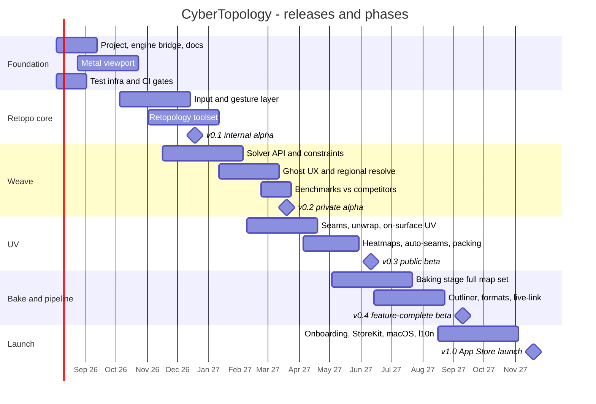

# CyberTopology — Product Roadmap

> Working title: **CyberTopology**. Companion to the OpenSpec change [`add-cybertopology-app`](../openspec/changes/add-cybertopology-app/) — this document sequences its 9 task phases into releases with dates, gates, and success criteria. Specs are the contract; this is the schedule. Drafted 2026-07-20.

## Strategic Window

CozyBlanket 2.x has been in maintenance mode since May 2025, and CozyBlanket Pro is in closed beta (public launch date unknown). The plan below targets a **public beta in Q2 2027** and **v1.0 in Q4 2027** — every quarter of slip narrows the window against Pro's public launch. Weave (the deterministic constraint-driven solver) is the moat either way: it is the one feature Pro's "no more puzzle solving" AI positioning cannot copy without contradicting itself.

## Release Timeline

Dates assume a small senior team (2–3 engineers + the engine maintainers) and are calibrated to quarter granularity — treat mid-phase dates as planning aids, milestone quarters as commitments.

## Milestones

### v0.1 — Internal alpha (target: Dec 2026) — "You can retopologize"

The RT vertical slice, dogfoodable by the team on real sculpts.

- Phases 1–4 of [`tasks.md`](../openspec/changes/add-cybertopology-app/tasks.md): project + CyberKit bridge, document model with autosave/undo, OBJ in/out, Metal viewport (multi-million-tri targets, animated overlay, x-ray, camera rescue), full gesture grammar with interpretation chip + hover previews, complete RT action roster, multi-axis/radial symmetry.
- Test infra live from week one: coverage gates (>90% per layer), traceability map, stroke-fixture replay harness (tasks 1.1a/1.1b).
- **Exit criteria:** a team member retopologizes a real head sculpt start-to-finish faster than in Blender; gesture recognition failure rate measured and trending down; 5M-tri target at 60 fps on M1 iPad Air.

### v0.2 — Private alpha (target: Mar 2027) — "Weave works"

The differentiator lands. TestFlight to ~50 invited retopo artists under NDA.

- Phase 5: solver API integration, all six constraint types, prescribed-boundary guarantee with golden-file tests, ghost accept/override flow, regional live re-solve, ambient assist, implicit sizing.
- Benchmark run vs AutoRemesher / Quadriflow / Instant Meshes published internally — the "better than" marketing claim becomes a measured number before we say it publicly.
- **Exit criteria:** frozen-patch bit-identity holds on every alpha document; full-body character done in the hybrid flow (hand loops + Weave fill) in under 1 hour; determinism verified simulator-vs-device.

### v0.3 — Public beta (target: Jun 2027) — "The pipeline's second stage"

Open TestFlight. This is the release that starts the clock against CozyBlanket Pro.

- Phase 6: UV stage complete — 3D/2D seam authoring, X-gesture unwrap, on-surface pinch UV transform, distortion/texel-density heatmaps, auto-seam ghosts, Metal-compute packing, symmetry stacking, UDIMs, UV-only project type.
- Pricing page + waitlist live; begin localization string freeze discipline.
- **Exit criteria:** import → retopo → unwrap → export OBJ works end-to-end for external users; packing 200 islands at interactive speed; beta crash-free rate above 99.5%.

### v0.4 — Feature-complete beta (target: Sep 2027) — "Game-ready out the door"

- Phase 7: baking — draw-to-link, per-vertex cage brushes, Metal RT + fallback with identical outputs, full map set (normals, AO, bent normals, curvature, thickness, position, ID), progressive live preview, MikkTSpace golden files, texture-to-texture rebake.
- Phase 8: outliner, FBX/glTF/USD(z) import/export, live-link protocol + Blender add-on + pip client.
- **Exit criteria:** a sculpt baked here shades identically in Blender/Unity/Unreal; Blender round-trip demo recorded; every spec scenario has a linked passing integration test (traceability CI green).

### v1.0 — App Store launch (target: Nov 2027)

- Phase 9: interactive tutorial on the bundled model, Action Gallery demo videos, StoreKit tiers (Free saves forever / Core ≈ $29.99 / Studio ≈ $59.99, universal purchase), macOS shell, JP/KR/zh-CN/pt-BR localization, device-test release gate (task 9.6), App Store assets.
- Launch narrative: *"What you draw is what ships"* — deterministic hybrid retopo vs Pro's black-box AI; under half CozyBlanket's price; saving never paywalled.

## Post-1.0 Themes (unscheduled backlog)

| Theme | Notes |
|---|---|
| Live-link bidirectional sync v2 + Maya/ZBrush clients | Protocol shipped at 1.0; deepen desktop integration |
| ML-initialized orientation fields inside Weave | Learned prior, constraints still win — spec'd as solver-internal |
| Additional locales + iPad↔Mac handoff polish | Driven by launch analytics-free signals (reviews, support) |
| Vulkan/WGPU shell groundwork | Engine already portable; only if market pull justifies |

## Standing Gates (every release)

1. `openspec validate --all --strict` green; implementation never ahead of spec.
2. Coverage >90% per layer; no unmapped spec scenarios (quality-assurance spec).
3. Device-only test plan passing on one RT-capable + one baseline device before any TestFlight/App Store build.
4. No telemetry, no accounts, "Data Not Collected" — verified by network audit test.
5. Engine license audit permissive-only (clean-room quad extraction) before any binary ships.

## Top Risks to the Schedule

| Risk | Impact | Mitigation |
|---|---|---|
| Prescribed-boundary solver takes longer than phase 5 allows | Slips v0.2+, the whole differentiator | Ghost-accept UX ships with a slower solver first; solver quality iterates behind a stable API; benchmark harness catches regressions |
| CozyBlanket Pro launches publicly before our v0.3 | Loses first-mover framing | v0.1/v0.2 scope is fixed; if Pro launches early, pull UV auto-seams forward and lead with determinism + price instead of novelty |
| Swift↔C++ interop friction slows every phase | Constant tax | CyberKit façade isolates it; Objective-C++ escape hatch; interop patterns settled in phase 1, not discovered late |
| Gesture recognition quality plateau | Product feels worse than CozyBlanket | Interpretation records + fixture corpus from day one; recognition failure rate is a tracked metric with a target, not a vibe |
