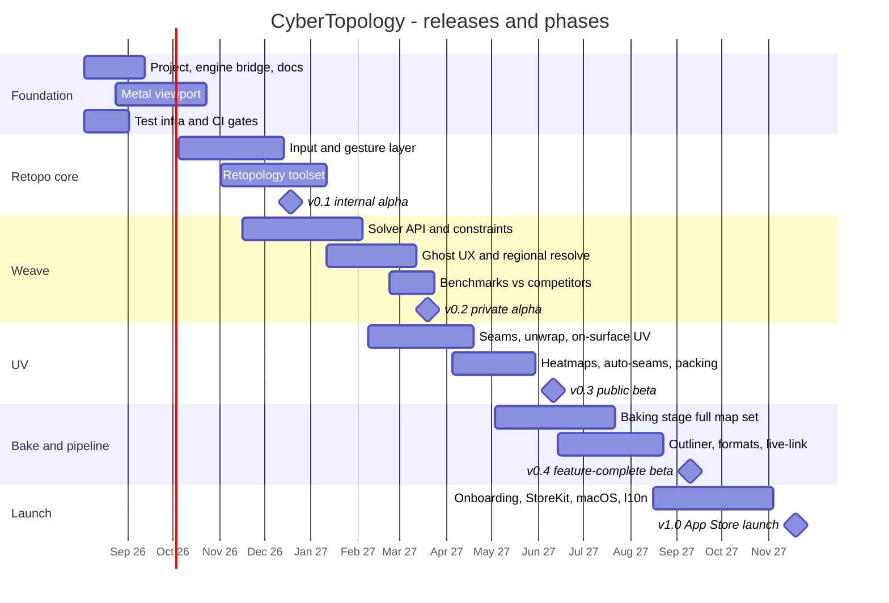

# CyberTopology — Product Roadmap

> Working title: **CyberTopology**. Companion to the OpenSpec change [`add-cybertopology-app`](../openspec/changes/add-cybertopology-app/) — this document sequences its 9 task phases into releases with dates, gates, and success criteria. Specs are the contract; this is the schedule. Drafted 2026-07-20.

## Strategic Window

CozyBlanket 2.x has been in maintenance mode since May 2025, and CozyBlanket Pro is in closed beta (public launch date unknown). The plan below targets a **public beta in Q2 2027** and **v1.0 in Q4 2027** — every quarter of slip narrows the window against Pro's public launch. Weave (the deterministic constraint-driven solver) is the moat either way: it is the one feature Pro's "no more puzzle solving" AI positioning cannot copy without contradicting itself.

## Release Timeline

```mermaid
gantt
    title CyberTopology - releases and phases
    dateFormat YYYY-MM-DD
    axisFormat %b %y

    section Foundation
    Project, engine bridge, docs      :p1, 2026-08-03, 40d
    Metal viewport                    :p2, 2026-08-24, 60d
    Test infra and CI gates           :p0, 2026-08-03, 30d

    section Retopo core
    Input and gesture layer           :p3, 2026-10-05, 70d
    Retopology toolset                :p4, 2026-11-02, 70d
    v0.1 internal alpha               :milestone, 2026-12-18, 0d

    section Weave
    Solver API and constraints        :p5a, 2026-11-16, 80d
    Ghost UX and regional resolve     :p5b, 2027-01-11, 60d
    Benchmarks vs competitors         :p5c, 2027-02-22, 30d
    v0.2 private alpha                :milestone, 2027-03-19, 0d

    section UV
    Seams, unwrap, on-surface UV      :p6a, 2027-02-08, 70d
    Heatmaps, auto-seams, packing     :p6b, 2027-04-05, 55d
    v0.3 public beta                  :milestone, 2027-06-11, 0d

    section Bake and pipeline
    Baking stage full map set         :p7, 2027-05-03, 80d
    Outliner, formats, live-link      :p8, 2027-06-14, 70d
    v0.4 feature-complete beta        :milestone, 2027-09-10, 0d

    section Launch
    Onboarding, StoreKit, macOS, l10n :p9, 2027-08-16, 80d
    v1.0 App Store launch             :milestone, 2027-11-19, 0d
```

Dates assume a small senior team (2–3 engineers + the engine maintainers) and are calibrated to quarter granularity — treat mid-phase dates as planning aids, milestone quarters as commitments.

## Milestones

### v0.1 — Internal alpha (target: Dec 2026) — "You can retopologize"

The RT vertical slice, dogfoodable by the team on real sculpts.

- Phases 1–4 of [`tasks.md`](../openspec/changes/add-cybertopology-app/tasks.md): project + CyberKit bridge, document model with autosave/undo, OBJ in/out, Metal viewport (multi-million-tri targets, animated overlay, x-ray, camera rescue), full gesture grammar with interpretation chip + hover previews, complete RT action roster, multi-axis/radial symmetry.
- Test infra live from week one: coverage gates (>90% per layer), traceability map, stroke-fixture replay harness (tasks 1.1a/1.1b).
- **Exit criteria:** a team member retopologizes a real head sculpt start-to-finish faster than in Blender; gesture recognition failure rate measured and trending down; 5M-tri target at 60 fps on M1 iPad Air.

### v0.2 — Private alpha (target: Mar 2027) — "Weave works"

The differentiator lands. TestFlight to ~50 invited retopo artists under NDA.

- Phase 5: solver API integration, all six constraint types, prescribed-boundary guarantee with golden-file tests, ghost accept/override flow, regional live re-solve, ambient assist, implicit sizing.
- Benchmark run vs AutoRemesher / Quadriflow / Instant Meshes published internally — the "better than" marketing claim becomes a measured number before we say it publicly.
- **Exit criteria:** frozen-patch bit-identity holds on every alpha document; full-body character done in the hybrid flow (hand loops + Weave fill) in under 1 hour; determinism verified simulator-vs-device.

#### Phase 5 status — 13 of 16, and the marketing claim is now the PROVEN one

Per-task detail lives in [`tasks.md`](../openspec/changes/add-cybertopology-app/tasks.md);
this is the shape of what is left and why.

| item | state | what it is |
|---|---|---|
| 5.1, 5.1a | ✅ | solver API + region-scoped solve, float-free interface goldens |
| 5.2, 5.2a | ✅ | constraint plumbing — **five of six kinds honoured end to end** |
| 5.3 | ✅ | prescribed-boundary guarantee, **exact landing only** |
| 5.4, 5.4a | ✅ | ghost accept/override, Weave Fill (tap + paint), live re-solve |
| 5.5, 5.5a | ✅ | global density presets + implicit sizing from a prescribed interface |
| 5.2b | mostly | RADIAL symmetry done; density channel done, **brush UI open** |
| 5.3a | won't fix | interior-only singularities — 4 refuted attempts; **claim reworded instead** |
| 5.4b | ✅ | region solves project onto the Target — external reference surface |
| **5.4c** | open | filling bare Target with no open cage edge — needs the carve path |

Outside Phase 5, this pass also closed **4.3a** (annotation remainders: tags/pins now respect
the visibility lasso, and the Loop Info chip has a sticky mode), **9.3** (privacy manifest plus
a network audit wired into CI), and **8.1** (scene outliner: show/solo/lock, groups, per-object
stats — with the lock enforced as a command-layer refusal rather than a greyed-out button, and
solo kept as view state so un-soloing restores exactly what was configured).
| 5.6 | ✅ | ambient assist — satisfied by tap-to-fill; hover half declined |
| 5.7 | ✅ | benchmark corrections landed; competitor harnesses declined |

**5.3a is closed as won't-fix, and the CLAIM changed rather than the solver.** Face count
at an interface vertex is `n(b) − k(b)`. Four approaches have now been built and MEASURED,
and none converged: greedy ring-first pairing (changed the failure count by exactly zero),
degree-constrained pairing (deadlocks — a merge decrements both endpoints, so adjacent
interface vertices compete), degree-pairing plus a fan lock, and forcing `k(b) = 0` by
feature-locking interface-adjacent edges. The fourth is the most informative: the locking
worked, and conformance got strictly worse everywhere, because `q_in(b)` counts the QUADS
the cage expects while `k(b) = 0` guarantees triangles. What remains is a genuine
degree-constrained b-matching over the interface ring — `maximumTrianglePairing` is
blossom-free — and that was DECIDED against: substantial combinatorial optimisation, with
real risk it still fails on reflex rings, funded purely to support a marketing sentence. So
the sentence changed instead. **Weave is marketed on EXACT LANDING** — bitwise preservation
of a hand-authored boundary, enforced by a refusing gate — which is proven and which
competitors cannot do AT ALL, having no notion of a prescribed boundary. **Do not claim
Weave places no singularity on a prescribed interface.** Interface irregularity stays
measured and reported; 5.3a remains a documented quality gap, not a blocker.

**5.6 is closed: tap-to-fill IS the requirement.** The hover half was declined — an
unrequested proposal on every boundary hover means a speculative solve per hover, and the
armed tool already provides the opt-in control the task asked for. Reversible if artists ask
for it after real use.

**5.7: corrections landed, competitor harnesses declined.** One of the three "corrections"
turned out not to need making — the harness already labels our retired extractor
`ours position-field`, and no results table is published anywhere in the repo, so there were
no wrong numbers to withdraw. The two real ones are fixed: the harness now NAMES the backend
it measured and warns when `CYBER_WITH_QUADCOVER=ON` is in force (a configuration the iPad
does not ship, and one that builds QuadCover from vendored AutoRemesher/Geogram source), and
wall-clock plus determinism are measured rather than asserted in prose. Real competitor
harnesses are out of scope: with 5.3a's claim withdrawn, the honest comparison is exact
landing, where rivals are undefined rather than slower — which needs no competitor run.

### v0.3 — Public beta (target: Jun 2027) — "The pipeline's second stage"

#### Phase 6 status — 5 of 8 (6.1, 6.4, 6.5, 6.2b, 6.6 done; 6.2 all but its 2D half)

The entry point landed as `add-uv-stage-foundation`: engine UV READBACK (the real gate — the
atlas could write per-corner UVs that nothing could read, so a 2D view was impossible), the
`.uv` stage branching to a workspace, and one-tap unwrap as a single journaled step. The 2D
view is a SwiftUI `Canvas`, which also keeps 6.4's heatmap a fill rather than a new shader.

Split out as **6.1a**: the UV-only project type and split-view gestures.

**6.4 also landed**, and cheaper than that scoping claimed: I had recorded that its heatmap
needed a per-face distortion readout "that does not exist". It existed —
`cyber::uv::measureDistortion` already computed per-face angle error, area ratio and flipped
winding, and already drove the aggregate figures. Only the C API exposure was missing, so 6.4
was an exposure plus a fill in the Canvas. Texel density derives from the same area ratio,
which is what stops the per-face and aggregate numbers drifting apart.

**6.5 also landed**, and made it three scoping estimates in a row that undersold the engine:
`autoSeams` already existed and already ran inside `unwrapAtlas`, so the change was giving it
a BARRIER the artist's own seams supply, not writing seam detection. The limitation worth
carrying forward is that the chart MERGE passes are not barrier-aware — growth respects a
barrier but a merge can still cross one — so preservation is guaranteed by UNIONING the
barrier into the result rather than by the algorithm. Making the merges barrier-aware is the
real fix and is not done.

**6.2b landed, and it corrected a scoping claim in the OTHER direction** — the first time in
Phase 6. I had it down as needing corner pinning, "genuinely new solver work". It is not
required at all: the spec's only pinning is corner AUTO-pinning inside the relax scrub (6.3),
which `choosePins` already does. Artist-specified pins were scope I invented. What 6.2b really
contained was a destructive defect: the X gesture deleted faces in EVERY stage, including UV,
where the spec says it re-unwraps an island. An unset stage is now inert rather than
retopology, so a context that forgets a stage can no longer be silently destructive.

What the remaining tasks still need from the engine: **6.7** needs a document-model change,
since the atlas writes ONE UV set into the unit square. **6.3** is the largest remaining piece
and mostly has its engine primitives already (`layout.hpp` carries grid straightening, overlap
distribution and island stitching; `transforms.hpp` the move/rotate/scale). The seam half of
6.2's original scoping claim was wrong and is recorded as such.

Open TestFlight. This is the release that starts the clock against CozyBlanket Pro.

- Phase 6: UV stage complete — 3D/2D seam authoring, X-gesture unwrap, on-surface pinch UV transform, distortion/texel-density heatmaps, auto-seam ghosts, Metal-compute packing, symmetry stacking, UDIMs, UV-only project type.
- Pricing page + waitlist live; begin localization string freeze discipline.
- **Exit criteria:** import → retopo → unwrap → export OBJ works end-to-end for external users; packing 200 islands at interactive speed; beta crash-free rate above 99.5%.

### v0.4 — Feature-complete beta (target: Sep 2027) — "Game-ready out the door"

- Phase 7: baking — draw-to-link, per-vertex cage brushes, Metal RT + fallback with identical outputs, full map set (normals, AO, bent normals, curvature, thickness, position, ID), progressive live preview, MikkTSpace golden files, texture-to-texture rebake.
- Phase 8: outliner, FBX/glTF/USD(z) import/export, live-link protocol + Blender add-on + pip client.
- **Exit criteria:** a sculpt baked here shades identically in Blender/Unity/Unreal; Blender round-trip demo recorded; every spec scenario has a linked passing integration test (traceability CI green).

### v1.0 — App Store launch (target: Nov 2027)

- Phase 9: interactive tutorial on the bundled model, Action Gallery demo videos, StoreKit tiers (Free saves forever / Core ≈ $29.99 / Studio ≈ $59.99, universal purchase), macOS shell, JP/KR/zh-CN/pt-BR localization, device-test release gate (task 9.6), App Store assets.
- Launch narrative: *"What you draw is what ships"* — deterministic hybrid retopo vs Pro's black-box AI; under half CozyBlanket's price; saving never paywalled.

## Post-1.0 Themes (unscheduled backlog)

| Theme | Notes |
|---|---|
| Live-link bidirectional sync v2 + Maya/ZBrush clients | Protocol shipped at 1.0; deepen desktop integration |
| ML-initialized orientation fields inside Weave | Learned prior, constraints still win — spec'd as solver-internal |
| Additional locales + iPad↔Mac handoff polish | Driven by launch analytics-free signals (reviews, support) |
| Vulkan/WGPU shell groundwork | Engine already portable; only if market pull justifies |

## Standing Gates (every release)

1. `openspec validate --all --strict` green; implementation never ahead of spec.
2. Coverage >90% per layer; no unmapped spec scenarios (quality-assurance spec).
3. Device-only test plan passing on one RT-capable + one baseline device before any TestFlight/App Store build.
4. No telemetry, no accounts, "Data Not Collected" — verified by network audit test.
5. Engine license audit permissive-only (clean-room quad extraction) before any binary ships.

## Top Risks to the Schedule

| Risk | Impact | Mitigation |
|---|---|---|
| Prescribed-boundary solver takes longer than phase 5 allows | Slips v0.2+, the whole differentiator | Ghost-accept UX ships with a slower solver first; solver quality iterates behind a stable API; benchmark harness catches regressions |
| CozyBlanket Pro launches publicly before our v0.3 | Loses first-mover framing | v0.1/v0.2 scope is fixed; if Pro launches early, pull UV auto-seams forward and lead with determinism + price instead of novelty |
| Swift↔C++ interop friction slows every phase | Constant tax | CyberKit façade isolates it; Objective-C++ escape hatch; interop patterns settled in phase 1, not discovered late |
| Gesture recognition quality plateau | Product feels worse than CozyBlanket | Interpretation records + fixture corpus from day one; recognition failure rate is a tracked metric with a target, not a vibe |
